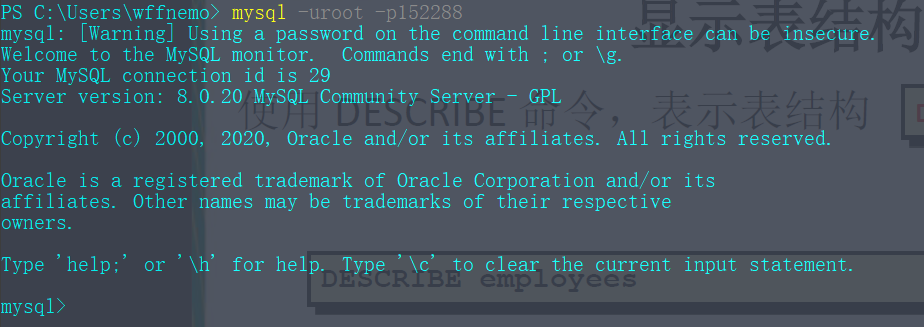

# MySQL常用操作

## 一、连接到MySQL

* 为了连接到MySQL，需要以下信息：
	* 主机名（计算机名）——如果连接到本地MySQL服务器，为`localhost`
	* 端口（使用默认端口3306之外的端口时不可省略）
	* 一个合法的用户名
	* 用户口令（如果需要）
* 连接到本地服务器
打开命令行，输入`mysql -uroot -p*****`,`-p`后输入密码

* 打开关闭MySQL服务
	* 打开：net start mysql服务名;
	* 关闭：net stop mysql服务名;

## 二、了解数据库和表

* 选择数据库
~~~mysql
use mydatabase;
~~~

* 显式所有数据库
~~~mysql
SHOW DATABASES;
~~~

* 获得数据库内所有表的列表
~~~mysql
SHOW TABLES;
~~~

* 显式指定表的表列
~~~mysql
SHOW COLUMNS FROM 	mytable；
~~~

* 显式表结构
~~~mysql
DESCRIBE mytable;
~~~

## 三、SELECT语句

* SELECT结构
~~~mysql
SELECT *|{[DISTINCT] COLUMN|expression [alias],...} 
FROM table;
~~~
* 选择全部列
~~~mysql
SELECT * FROM departments
~~~
* 选择指定列
~~~mysql
SELECT department_id, location_id
FROM departments
~~~
* [DISTINCT]使用方法
`DISTINCT`用于筛选掉重复值，且它是针对所有`COLUMN`进行筛选，即所有`COLUMN`值都相等时才会被筛掉

* 返回SELECT结果的前几行
~~~mysql
SELECT * 
FROM mytable
LIMIT 10；
~~~

* 返回SELECT结果从第几行开始的某几行
~~~mysql
SELECT * 
FROM mytable
LIMIT 5,5;
~~~

* 使用全限定表名
~~~mysql
SELECT * 
FROM mydatabase.mytable
~~~

## 四、列别名

* 列别名用法：紧跟列名，也可以在列名和别名之间加入关键字`AS`，别名可以使用双引号，以便在别名中包含空格或特殊的字符并区分大小写
* 使用`AS`：
~~~mysql
SELECT 	last_name AS name, commission_pct AS comm
FROM employees;
~~~
* 不使用`AS`：
~~~mysql
SELECT last_name "Name", salary*12 "Annual Salary"
FROM employees;
~~~

## 五、排序检索数据

* 关系数据库设计理论认为，如果不明确规定排序顺序，则不应该假定检索出的数据的顺序有意义。为了明确地排序用SELECT语句检索出的数据，可使用ORDER BY子句，ORDER BY子句取一个或多个列的名字，据此对输出进行排序
* 按某个列排序
~~~mysql
SELECT id
FROM mytable
ORDER BY name;
~~~

* 按多个列排序，如下所示，先按name进行排序，如果name相同，再按age排序
~~~mysql
SELECT id
FROM mytable
ORDER BY name,age;
~~~

* 指定排序方向，数据排序默认是升序排序（A~Z），用户可以指定降序排列（ASC（ascend）、DESC（descend））。注意，DESC只应用到直接位于其前面的列名，因此，如果想在多个列上进行降序排序，必须对每个列指定DESC关键字
~~~mysql
SELECT id,name,age
FROM mytable
ORDER BY age DESC,name;
~~~

* 找出列中最大或最小的值
~~~mysql
SELECT age
FROM mytable
ORDER BY age DESC
LIMIT 1;
~~~

## 六、过滤数据

* 只检索所需数据需要指定搜索条件，搜索条件也被称为过滤条件（filter condition）。同时使用WHERE子句和ORDER BY子句时，应将ORDER BY子句位于WHERE子句之后
* 一个简单例子
~~~mysql
SELECT id,age
FROM mytable
WHERE age = 22;
~~~

* WHERE子句操作符

|操作符|说明|
|:-:|:-:|
|=|等于|
|<>|不等于|
|!=|不等于|
|<|小于|
|<=|小于等于|
|>|大于|
|>=|大于等于|
|BETWEEN|在指定的两个值之间|

* BETWEEN的使用
~~~mysql
SELECT id,name,age
FROM mytable
WHERE age BETWEEN 18 AND 23;
~~~

## 七、数据过滤

* 为了进行更强的过滤控制，MySQL允许给出多个WHERE子句，这些子句可以两种方式使用：以AND子句或OR子句的方式使用
* AND操作符：为了通过不止一个列进行过滤，可以使用AND操作符给WHERE子句附加条件
~~~mysql
SELECT id,name,age,salary
FROM mytable
WHERE salary > 4000 AND age <30;
~~~

* OR操作符：匹配任一条件而不是同时匹配多个条件
~~~mysql
SELECT id,name,age,salary
FROM mytable
WHERE salary > 4000 OR age < 20;
~~~

* 注意，AND操作符优先级比OR优先级高，因此在使用操作符时应擅用圆括号。
~~~mysql
SELECT name,price
FROM mytalbe
WHERE (id = 1003 OR id = 1002) AND price > 30;
~~~

* IN操作符：IN操作符用来指定条件范围，范围中的每个条件都可以进行匹配
~~~mysql
SELECT name,price
FROM mytable
WHERE id in (1002,1003)
ORDER BY price;
~~~

* NOT操作符：NOT操作符用于否定它之后所跟的任何条件
~~~mysql
SELECT name,price
FROM mytable
WHERE id NOT IN (1002,1003)
ORDER BY name;
~~~

## 八、使用通配符进行过滤

* 通配符：用来匹配值的一部分的特殊字符，使用通配符时，必须使用`LIKE`操作符
* 百分号（%）通配符：`%`表示任何字符出现任意次数，`%`还能匹配零个字符。如下例，找出所有以jie开头的产品
~~~mysql
SELECT id,name
FROM mytable
WHERE name LIKE 'jet%';
~~~

* 下划线（\_）通配符：与`%`一样，但下划线只匹配单个字符，零字符都不匹配
* 通配符使用技巧：
	* 通配符比其他搜索所花时间更长，因此不要过度使用通配符，能不用就不用
	* 尽量不要把通配符放在搜索模式的开始处，这样能减小搜索范围
	* 注意通配符的使用位置

## 九、用正则表达式进行搜索

*  使用正则表达式进行搜索需要使用`REGEXP`关键字，与`LIKE`不同的是，`REGEXP`在列值内进行匹配，而`LIKE`对整个列进行匹配
*  正则表达式不区分大小写，如需要区分大小写，可以使用`BINARY`关键字，如`WHERE name REGEXP BINARY 'Wang F'`
*  基本字符匹配
~~~mysql
SELECT name
FROM mytable
WHERE name REGEXP '.1000'
ORDER BY name;
~~~
`.`是正则表达式中一个特殊的字符，它表示匹配任意一个字符

* 进行OR匹配，下例选择包含1000或2000的字符串
~~~mysql
SELECT name
FROM mytable
WHERE name REGEXP '1000|2000'
ORDER BY name;
~~~
`|`为正则表达式的OR操作符，它表示匹配其中之一

* 匹配几个字符之一
~~~mysql
SELECT name
FROM mytable
WHERE name REGEXP '[123] Ton'
ORDER BY name;
~~~
`[123] Ton`是`[1|2|3] Ton`的缩写，可以匹配`1 Ton`、`2 Ton`、`3 Ton`，`[]`用来定义OR语句查找什么
字符集也可以被否定，即它们将匹配除指定字符外的任何东西，为否定一个字符集，在集合的开始处放置一个`^`即可，因此，`[^123]`匹配除这些字符外的任何东西

* 匹配范围
  为简化匹配集合，可以使用`-`定义一个范围，如`[2-7]`、`[a-z]`
~~~mysql
SELECT name
FROM mytable
WHERE name REGEXP '[1-5] Ton'
ORDER BY name;
~~~

* 匹配特殊字符
为匹配特殊字符，必须使用`\\`为前导，`\\-`表示查找`-`，`\\.`表示查找`.`
MySQL需要使用两个反斜杠，一个用于MySQL解释，一个用于正则表达式解释
~~~mysql
SELECT name
FROM mytable
WHERE name REGEXP '\\\'
ORDER BY name;
~~~

* 匹配字符类
具体可以查看MySQL预定义字符集

* 匹配多个实例
使用元字符来对匹配的数目进行控制

|元字符|说明|
|:-:|:-:|
|\*|0个或多个匹配|
|+|1个或多个匹配|
|？|0个或1个匹配|
|{n}|指定数目的匹配|
|{n,}|不少于指定数目的匹配|
|{n,m}|匹配数目的范围（m不超过255）|

~~~mysql
SELECT name
FROM mytable
WHERE name REGEXP '[[:digit:]]{4}'
ORDER BY name;
~~~
匹配连在一起的任意4位数字

* 定位符
为了匹配特定位置的文本，可以使用定位符。使用`^`和`$`可以使`REGEXP`和`LIKE`的作用一样

|元字符|说明|
|:-:|:-:|
|^|文本的开始|
|$|文本的末尾|
|[[:<:]]|词的开始|
|[[:>:]]|词的末尾|

~~~mysql
SELECT name
FROM mytable
WHERE name REGEXP '^[0-9\\.]'
ORDER BY name;
~~~
匹配以任意数字或`.`为串中第一个字符的串
